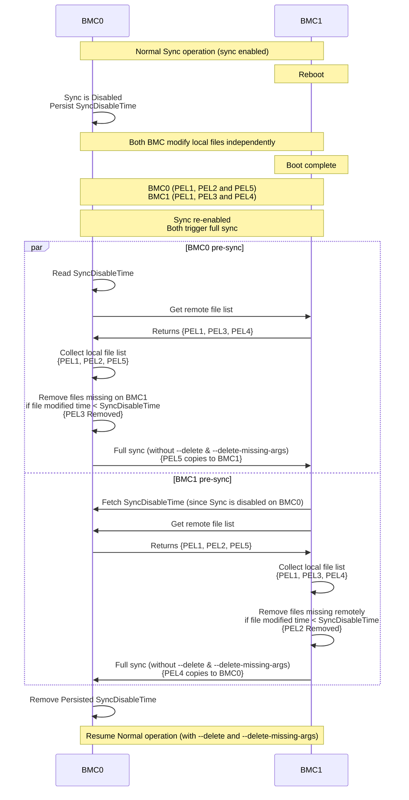

# phosphor-data-sync

The phosphor-data-sync application will be used in a redundant BMC system to
synchronize data between BMCs according to the data file details configured for
BMC applications.

> **TODO:** This README is not yet fully updated which will be handled as part
> of another PR

## Overview

[TODO]

### Key Features

[TODO]

### Full Sync for bidirectional sync paths

When `disable_sync` is set to `true`, both BMCs continue to operate
independently. data may be:

- **Created** on BMC0 that BMC1 has never seen.
- **Created** on BMC1 that BMC0 has never seen.
- **Deleted** on BMC0 that BMC1 still has.
- **Deleted** on BMC1 that BMC0 still has.

When sync is re-enabled, both BMC's will issue full sync simultaneosuly to its
peer and as result rsync operation with `--delete` and `--delete-missing-args`
will trigger from BMC0 → BMC1 would:

- Restore data that BMC1 deliberately deleted.
- Overwrite or delete data that BMC1 newly created.

This algorithm resolves the state before full sync triggers for the path
configured for bidirectional sync so that neither side's intentional changes
doesn't overwrite

For example : Let's consider syncing of PELs which configured for bidirectional
immediate sync.

**Filesystem State Example**

| BMC0                                        | BMC1                                       |
| ------------------------------------------- | ------------------------------------------ |
| Pel1 (Common)                               | Pel1 (Common)                              |
| Pel2 (exists)                               | Pel2 (DELETED during disabled window)      |
| Pel3 (DELETED during disabled window)       | Pel3 (exists)                              |
| Pel5 (Newly created during disabled window) | Pel4(Newly created during disabled window) |

**Expected outcome after full sync:**

| File   | Action                                           |
| ------ | ------------------------------------------------ |
| `Pel1` | No action — identical on both sides              |
| `Pel2` | Delete from BMC0 (BMC1 deleted it intentionally) |
| `Pel3` | Delete from BMC1 (BMC0 deleted it intentionally) |
| `Pel4` | Copy from BMC1 → BMC0 (newly created on BMC1)    |
| `Pel5` | Copy from BMC0 → BMC1 (newly created on BMC0)    |

---

## Flow diagram of solution

The diagram below shows the complete lifecycle across both BMCs, from startup
through sync-disabled operation to re-enabled full sync.



---

## To build

```sh
meson setup builddir
meson compile -C builddir
```
